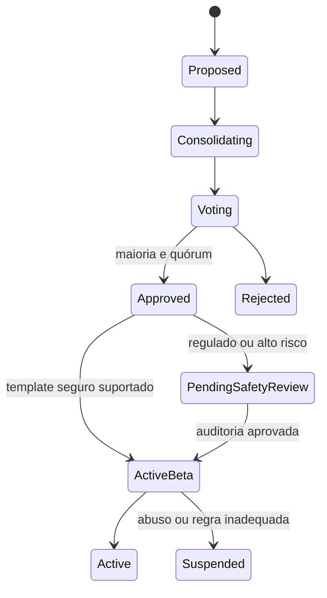

# Conselho do Reino e evolução do catálogo

## Objetivo

Permitir que a comunidade escolha mensalmente novos serviços sem criar uma skill diferente para cada texto digitado e sem exigir uma versão nova do aplicativo para toda categoria simples.

Usuários não publicam tipos de serviço diretamente. Eles propõem candidatos ao catálogo ou votam em propostas consolidadas. O vencedor é transformado automaticamente em uma definição versionada quando puder usar o workflow genérico já suportado.

## Serviço, skill e proficiência

- **Serviço:** aquilo que o jogador contrata, como “trocar chuveiro”.
- **Skill:** capacidade reutilizável, como `PLUMBING`.
- **Proficiência:** progresso individual do jogador naquela skill.

Vários serviços podem conceder XP à mesma skill. Uma quest não cria automaticamente uma nova skill; ela referencia somente skills canônicas do catálogo. Se uma proposta exigir uma capacidade ainda inexistente, essa skill passa por normalização e aprovação própria antes de entrar no mapa de recompensas.

Isso evita variações duplicadas como “encanador”, “hidráulica”, “troca de torneira” e “reparo de cano” virarem quatro trilhas desconectadas.

## Ciclo mensal

1. **Proposição:** jogadores sugerem um nome, descrição, exemplos e skills relacionadas existentes.
2. **Consolidação:** propostas duplicadas ou sinônimas são agrupadas e recebem uma definição candidata.
3. **Votação:** contas elegíveis votam entre candidatos válidos durante uma janela explícita.
4. **Apuração:** maioria dos votos válidos, quórum mínimo e controles antissybil determinam o vencedor.
5. **Publicação automática:** o sistema cria `ServiceDefinition v1`, formulário genérico, política de matching e mapa de XP.
6. **Beta observável:** quests usam a versão publicada e coletam métricas, denúncias e feedback.
7. **Auditoria fina:** desenvolvimento/operação pode ajustar campos, pesos, requisitos e segurança em uma nova versão, sem reescrever o histórico.

Propostas, votos, resultado e versão publicada são auditáveis. Mudanças posteriores nunca alteram retroativamente quests antigas, que preservam uma fotografia da definição usada.

## Limite da automação

A ativação é automática quando o serviço cabe nos componentes já suportados, por exemplo:

- presencial, remoto ou híbrido;
- descrição, fotos e anexos;
- agenda e duração estimada;
- preço fixo, orçamento ou candidatura;
- localização aproximada antes da atribuição;
- skills e credenciais já existentes;
- checklist e evidência de conclusão.

Propostas ilegais, discriminatórias ou incompatíveis com os termos são removidas antes da votação e não entram no catálogo. Serviços regulados, de alto risco ou que exijam um workflow ainda inexistente entram automaticamente como `APPROVED_PENDING_SAFETY_REVIEW`, mas não aceitam quests até cumprir os gates necessários. Exemplos sensíveis incluem saúde, atividades jurídicas, gás, trabalho em altura e intervenções elétricas complexas.

A maioria escolhe a prioridade do produto; ela não pode remover controles legais, privacidade, idade mínima, licenças ou segurança.

## Interface genérica orientada a schema

Uma `ServiceDefinition` usa blocos aprovados e versionados:

- campos: texto, seleção, quantidade, fotos, anexos e endereço;
- execução: remoto/presencial, agenda, duração e checklist;
- atribuição: aceite, candidatura, convite ou orçamento;
- requisitos: level, karma contextual, skill, proficiência e credencial;
- conclusão: confirmação, evidência, aceite e disputa;
- progressão: skills, pesos de XP, limites e versão da regra.

Android, iOS e web renderizam os mesmos blocos com componentes nativos. O schema controla composição e validação declarativa, não executa código enviado por usuários.

A proposta pode sugerir quais skills se relacionam ao serviço, mas não escolhe livremente a quantidade de XP. Pesos, limites por período, confirmação e controles antifarming vêm de políticas versionadas e limitadas pelo servidor. Mapeamentos ambíguos deixam o serviço pendente de refinamento em vez de criar progressão explorável.

## Integridade da votação

O primeiro modelo deve incluir:

- conta verificada e idade mínima da conta para votar;
- um voto efetivo por jogador em cada ciclo;
- quórum mínimo e publicação transparente da apuração;
- detecção de contas coordenadas, compra de votos e spam;
- moderação de nomes, duplicatas, conteúdo ilegal e propostas discriminatórias;
- registro imutável do fechamento e da definição gerada;
- suspensão e rollback operacional sem apagar votos ou quests históricas.

Os critérios exatos de elegibilidade e quórum serão calibrados no beta. Level alto não deve permitir comprar ou concentrar votos indefinidamente.

## Persistência planejada

- catálogo: `service_categories`, `service_definitions`, `service_definition_versions`;
- composição: `service_form_blocks`, `service_skill_rewards`, `service_requirements`;
- conselho: `service_proposals`, `proposal_relations`, `council_cycles`, `council_ballots`, `council_votes`, `council_results`;
- operação: `service_risk_assessments`, `service_audit_events`, `service_rollouts`.
