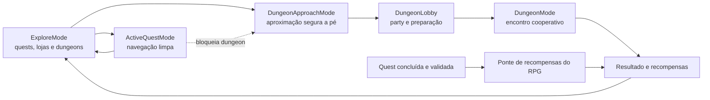

# RPG geolocalizado e dungeons

## Objetivo

Transformar o avatar do Minimapa em um personagem jogável e o mapa de exploração em um mundo compartilhado. Dungeons são pontos de interesse seguros onde jogadores, individualmente ou em party, iniciam encontros cooperativos e recebem XP de jogo, Gold e itens digitais.

Esse sistema é uma camada posterior ao núcleo de quests e navegação. Sua arquitetura pode ser preparada desde cedo, mas a operação pública só entra depois que localização, segurança, confiança e o fluxo principal estiverem validados.

## Fronteiras obrigatórias

- O RPG nunca interfere no `ActiveQuestMode` nem disputa atenção com navegação curva a curva.
- Não é possível iniciar ou interagir com uma dungeon enquanto o usuário dirige ou está em deslocamento incompatível com uso seguro.
- A integração é unidirecional: concluir quests reais pode melhorar o RPG; jogar o RPG nunca melhora requisitos ou resultados profissionais.
- XP, skills e equipamentos de dungeon não alteram proficiência profissional, karma, credenciais, elegibilidade, matching, remuneração ou prioridade em quests reais.
- Concluir uma dungeon não comprova habilidade profissional. XP profissional nasce apenas de quests reais elegíveis e credenciais verificadas.
- Itens e Gold não podem ser sacados, transferidos entre usuários ou usados para pagar bens e serviços físicos.
- Pontos patrocinados e dungeons patrocinadas são identificados e aparecem somente em exploração.

## Modos do mapa

`ExploreMode` pode mostrar dungeons disponíveis. `DungeonApproachMode` auxilia a aproximação a pé sem assumir o papel da navegação veicular. `DungeonMode` desmonta camadas comerciais e concentra a interface no encontro. Ao entrar em `ActiveQuestMode`, todas as camadas, convites e interações de dungeon são removidos.

## Progressões e economias

| Eixo | Origem | Uso | Pode afetar quests profissionais? |
| --- | --- | --- | --- |
| Nível global | participação segura no ecossistema | identidade e progressão geral | não concede credencial ou elegibilidade |
| XP profissional | quests reais e credenciais verificadas | proficiência em serviços canônicos | sim, pelas regras auditáveis do serviço |
| XP de jogo | dungeons, eventos e bônus de quests concluídas | level, classe e skills do avatar jogável | não |
| Gold | dungeons, bônus de quests e, futuramente, compra transparente | cosméticos e itens digitais permitidos | não |
| Chaves de Aventura | franquia diária/semanal/mensal | limitar entradas com recompensa | não; inicialmente não comprável |
| Dinheiro real | publicidade e marketplace | pagamentos comerciais separados | nunca se mistura aos ledgers de jogo |

Gold é uma moeda virtual fechada. Seu ledger é imutável, idempotente e separado de dinheiro real. Caso a compra de Gold seja avaliada no futuro, preço em moeda local, equivalência, saldo e reembolso devem ser transparentes e a integração deve seguir as regras das lojas. Até lá, Gold será apenas conquistável em ambientes locais ou beta sem cobrança.

Chaves de Aventura não são uma moeda. São uma franquia de participação com `granted`, `consumed`, `refunded`, janela de validade e limites configuráveis. No primeiro desenho não são transferíveis nem compráveis. Isso permite balancear atividade diária, semanal e mensal sem pay-to-win.

Tokens especiais de loja podem existir como itens ou vouchers digitais cosméticos, mas nunca substituem KYC, Licença de Guilda, pagamento, estoque ou autorização para operar uma loja real.

### Ponte unidirecional Quest → RPG

Uma conclusão de quest validada emite um evento de domínio imutável. Uma política versionada pode transformá-lo em XP global, XP de jogo, Gold, cosméticos ou progresso temático no RPG. A concessão é server-side, idempotente e separada da remuneração financeira e do XP profissional da quest.

Essa ponte possui somente o sentido Quest → RPG. O serviço de elegibilidade profissional não consulta level de combate, equipamento, inventário, Gold, dungeon ou qualquer outro estado lúdico. Recompensas de jogo devem ter caps e regras transparentes para não incentivar execução insegura, spam ou permanência em uma quest que deveria ser cancelada.

## Modelo de domínio

- `DungeonDefinition`: conteúdo versionado, requisitos, encontros e tabela de recompensas.
- `DungeonLocation`: ponto geográfico, raio de interação, acessibilidade, horários e estado de segurança.
- `DungeonInstance`: ocorrência agendada de uma definição em um local.
- `DungeonParty`: grupo público, privado ou por convite, liderança, membros e limite de tamanho.
- `DungeonRun`: tentativa idempotente, participantes, estado, timestamps e resultado.
- `DungeonEncounter`: etapa do combate/desafio com regras determinísticas e eventos auditáveis.
- `GameSkill` e `PlayerGameProgress`: progressão exclusivamente lúdica.
- `PlayerLoadout`: itens cosméticos e equipamentos com efeitos restritos ao RPG.
- `AdventureAllowance`: concessões e consumo de Chaves de Aventura.
- `GameRewardLedger` e `GoldLedger`: concessões, consumos, estornos e ajustes imutáveis.
- `QuestGameRewardPolicy`: regra versionada que converte uma conclusão de quest válida em recompensa exclusivamente lúdica.

Definições são orientadas a dados, validadas por schema e versionadas. Conteúdo aprovado pode combinar blocos de encontro conhecidos, mas nunca injeta código executável arbitrário.

## Ciclo de uma dungeon

1. O servidor publica uma instância `scheduled` em um ponto previamente aprovado.
2. Dentro da janela, ela passa a `available` e aparece no mapa de exploração.
3. Um jogador fisicamente elegível abre o lobby e forma uma party pública, privada ou por convite.
4. O servidor valida localização, movimento seguro, cooldown, Chaves de Aventura e integridade da conta.
5. A run passa a `active`; cada ação gera um evento ordenado e deduplicável.
6. Ao resolver ou abandonar, a run passa a `completed` ou `failed`.
7. Recompensas são calculadas server-side por tabela versionada, sujeitas a caps, e gravadas uma única vez.
8. A instância entra em cooldown ou encerra sua janela.

Probabilidades de drops aleatórios devem ser transparentes. Itens pagos e mecânicas semelhantes a loot boxes exigem revisão jurídica e das políticas das lojas antes de qualquer implementação.

## Party e encontro

O primeiro encontro deve ser cooperativo e simples, com papéis de jogo opcionais e nenhuma relação com profissões reais. O backend é autoritativo sobre composição, energia, ações, resolução e recompensa. O cliente renderiza o estado e envia intenções.

Parties precisam de convite, expulsão, saída, bloqueio, denúncia e proteção da localização. A posição exata de um participante não é publicada ao grupo; mostrar distância aproximada ou presença no raio até que haja consentimento e necessidade legítima.

## Segurança geográfica e antiabuso

- Usar somente espaços públicos aprovados, com horários, acesso permitido, iluminação e rota segura.
- Excluir propriedade privada, vias rápidas, áreas de risco, canteiros, trilhos e pontos que incentivem invasão.
- Considerar acessibilidade e oferecer alternativa remota ou equivalente quando adequado.
- Bloquear interação por sinais de direção/movimento, por conflito com quest ativa e por precisão insuficiente.
- Tratar GPS como sinal, não como prova absoluta; combinar velocidade, coerência temporal, integridade do dispositivo e cooldowns proporcionais.
- Detectar spoofing, multiaccount e farming sem coletar mais localização do que a finalidade exige.
- Prever moderação, incidentes, clima severo, menores de idade e retirada emergencial de um ponto.

## Vertical slice sem custo

Antes de mapas pagos, cloud ou AR, validar no emulador Android:

1. uma dungeon mockada em coordenada local;
2. deslocamento simulado por GPS do emulador;
3. lobby com um jogador e membros-bot;
4. um encontro cooperativo curto orientado a eventos;
5. consumo idempotente de uma Chave de Aventura;
6. recompensa de XP de jogo, Gold e um item em ledger local;
7. bloqueio completo ao entrar em `ActiveQuestMode` ou simular velocidade veicular.

Essa fatia comprova os contratos e a experiência sem habilitar billing, API faturável ou prêmio com valor real.

## Evolução para AR

O estado da dungeon deve ser independente do renderer. Hoje ele alimenta Compose 2D; futuramente poderá posicionar portal, inimigos, membros da party e efeitos em AR. A experiência AR deve exigir usuário parado ou a pé, fallback 2D, precisão mínima e validação específica de distração, bateria, temperatura e cobertura geoespacial.
