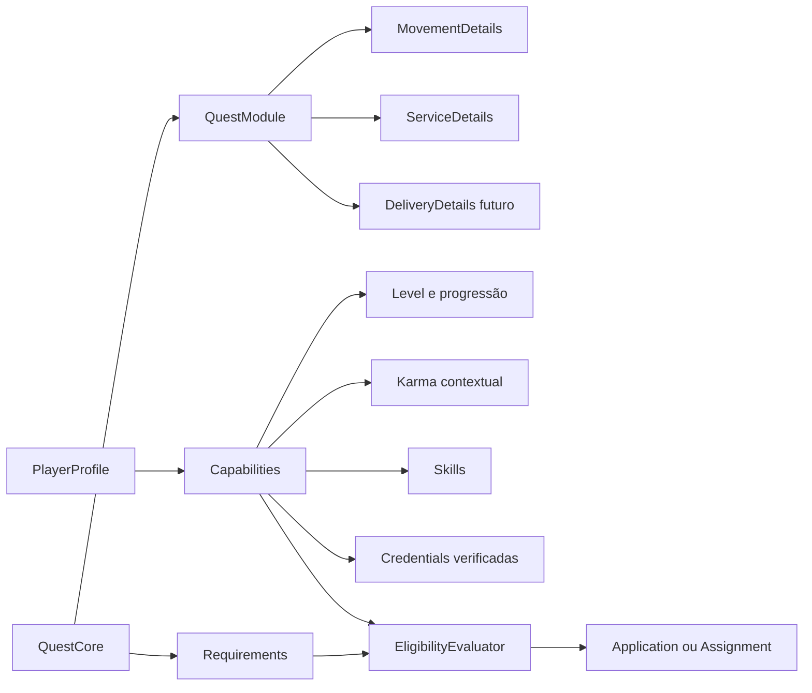

# Motor extensível de quests

## Objetivo

Tratar `Quest` como um contrato genérico de trabalho, deslocamento ou colaboração. O primeiro produto usa quests de deslocamento, mas o núcleo não pode presumir que toda quest possui motorista, veículo, origem e destino.

O modelo combina um núcleo relacional estável com módulos tipados. Campos universais permanecem em `quests`; detalhes específicos ficam em estruturas próprias de cada módulo. Não serão aceitos scripts ou regras arbitrárias enviados pelo cliente.

## Núcleo universal

Toda quest possui, no mínimo:

- identidade, criador e versão;
- tipo/módulo e categoria;
- título, descrição e anexos permitidos;
- visibilidade e região de descoberta;
- janela de execução ou agendamento;
- recompensa e moeda, quando aplicável;
- estratégia de atribuição;
- requisitos de elegibilidade;
- estado, responsáveis e linha do tempo auditável.

O núcleo não conhece termos como `driver`, `vehicle` ou `destination`. Esses conceitos pertencem ao módulo de deslocamento.

## Módulos tipados

### Deslocamento

- origem, destino e possíveis paradas;
- passageiro, item ou modalidade;
- veículo e requisitos legais;
- rota, sessão de navegação, chegada e localização ao vivo.

#### Valor sugerido para transporte

Ao preparar uma quest de deslocamento, a plataforma pode apresentar uma faixa sugerida baseada em quests comparáveis concluídas nos 30 dias anteriores. A sugestão é informativa e editável: não é tarifa obrigatória, garantia de aceite nem comissão do Minimapa.

A primeira versão usa estatística robusta e explicável, sem IA:

1. selecionar apenas quests concluídas, não disputadas, com partes verificadas e dados de rota válidos;
2. separar valor acordado de gorjeta, pedágio, estacionamento, reembolso e outros custos explícitos;
3. agrupar por região, modalidade, veículo, faixa de distância e período do dia;
4. calcular a mediana do valor líquido por quilômetro, removendo ou limitando outliers e contribuições repetidas suspeitas;
5. multiplicar pela distância planejada e reaplicar somente os custos explícitos conhecidos;
6. apresentar centro, faixa interquartil ou faixa mínima de variação, tamanho da amostra e confiança.

Usar apenas a média aritmética de `valor / km` distorce viagens curtas, congestionadas e amostras com extremos. Faixas de distância e duração estimada devem participar da seleção; depois de haver volume suficiente, pode-se testar um modelo robusto com componentes de partida, distância e tempo, sempre mantendo uma decomposição compreensível.

A agregação exige uma amostra mínima configurável, inicialmente 30 quests independentes. Abaixo disso, o algoritmo pode ampliar progressivamente região ou janela histórica e reduz a confiança. Se ainda não houver base suficiente, não mostra valor sugerido: o autor informa sua oferta e a interface declara que ainda não existem dados comparáveis. Nenhuma estatística é exibida para grupos abaixo do limiar de privacidade.

Cada cálculo gera um `PriceSuggestionSnapshot` com versão da política, filtros, janela, tamanho da amostra, percentis, distância, custos, faixa e confiança. O snapshot fica ligado à quest para auditoria, mesmo que o autor escolha outro valor.

Controles antiabuso limitam a influência de uma mesma dupla ou conta, excluem fraude/disputa e monitoram manipulação coordenada. Cancelamento por segurança nunca deve gerar penalidade para atingir preço ou recompensa. O estimador não usa Gold, level, equipamento, karma ou qualquer estado do RPG.

### Prestação de serviço

- local presencial, remoto ou híbrido;
- escopo do serviço e categoria, como encanamento;
- fotos, diagnóstico inicial e materiais;
- disponibilidade, duração estimada e agendamento;
- evidências de execução e aceite do resultado.

#### Preço de serviços e cold start

No lançamento, a plataforma não possui base legítima para sugerir o preço de um serviço. O fluxo padrão usa `QUOTE_AND_SCHEDULE`: o autor descreve o escopo, pode informar um orçamento opcional e recebe propostas dos jogadores elegíveis com mão de obra, prazo, deslocamento e materiais discriminados. “A combinar” também é um estado válido.

Depois de existir amostra mínima, o sistema pode exibir uma **faixa histórica**, nunca um orçamento garantido. A comparação exige a mesma definição e versão canônica de serviço, região compatível e atributos estruturados de escopo, complexidade e duração. Materiais, taxas e deslocamento permanecem separados da mão de obra.

Não se calcula uma mediana genérica entre serviços diferentes. Uma troca de chuveiro não fornece base automática para instalação elétrica, e um serviço recém-aprovado pelo Conselho do Reino começa sem sugestão até formar sua própria amostra ou possuir um mapeamento revisado e justificável.

As observações elegíveis são conclusões não disputadas entre partes verificadas. A faixa mostra período, quantidade e confiança, e desaparece quando o segmento não atinge o limiar de privacidade. Fontes externas, tabelas profissionais ou pisos legais entram somente como referências separadas, identificadas, versionadas e revisadas conforme `external-price-references.md`; não são misturadas silenciosamente à mediana do Minimapa.

Novos módulos implementam contratos conhecidos de validação, apresentação, matching e ciclo de vida. Templates criados por usuários ou empresas poderão combinar capacidades suportadas, mas não criar código executável nem alterar regras de segurança.

## Requisitos e elegibilidade

Requisitos são predicados tipados e versionados, por exemplo:

- `MinimumLevel(level = 10)`;
- `MinimumKarma(score = 80, scope = PLUMBING)`;
- `RequiredSkill(skill = PLUMBING, minimumProficiency = INTERMEDIATE)`;
- `RequiredCredential(type = PLUMBING_COURSE, verification = VERIFIED)`;
- `RequiredIdentityVerification(level = IDENTITY_VERIFIED)`;
- `MaximumDistance(kilometers = 15)`;
- `RequiredVehicle(type = MOTORCYCLE)`.

O servidor avalia todos os predicados e retorna um resultado explicável: elegível, não elegível ou pendente de comprovação, com motivos seguros para exibição. A decisão usa uma fotografia versionada das qualificações no momento da candidatura ou aceite para permitir auditoria posterior.

Identidade verificada é requisito estrutural para executar qualquer quest e não pode ser removida pelo criador, template ou Conselho do Reino. Quests publicadas por solicitantes ainda não verificados permanecem limitadas até a verificação ocorrer.

Requisitos não podem usar atributos protegidos ou criar discriminação ilegal. O cliente nunca decide sozinho se um jogador é elegível.

## Skills, credenciais e reputação

Uma skill representa capacidade, não necessariamente comprovação. Ela pode ter níveis de confiança:

1. autodeclarada;
2. endossada por avaliações relacionadas;
3. comprovada por credencial;
4. verificada pela plataforma ou parceiro autorizado.

Uma credencial registra tipo, emissor, titular, evidência protegida, datas de emissão/validade e estado de verificação. Documentos brutos ficam privados; quem publica a quest recebe apenas a afirmação necessária, como “curso de instalações hidráulicas verificado”.

### Proficiência e XP por skill

Level global, proficiência e comprovação são eixos independentes:

- **level global:** participação e progressão geral no Minimapa;
- **XP de skill:** experiência prática acumulada em uma capacidade específica;
- **proficiência:** faixa derivada do XP daquela skill, como aprendiz, competente, especialista e mestre;
- **verificação:** confiança externa proveniente de credencial, parceiro ou auditoria.

Cada definição de serviço possui um mapa versionado de skills e pesos. Concluir uma quest de troca de chuveiro pode conceder XP principal em `PLUMBING` e, quando o escopo realmente exigir, XP secundário em outra skill já aprovada. O evento `QuestCompleted` cria lançamentos idempotentes em `skill_xp_ledger`; uma mesma execução nunca concede XP duas vezes.

O XP pode nascer como pendente e ser confirmado após aceite do resultado ou janela curta de disputa. Fraude, cancelamento ou decisão de disputa pode bloquear ou reverter a concessão por evento compensatório, sem apagar o histórico.

O perfil não materializa milhares de skills vazias. Uma skill aparece para o jogador somente quando existe pelo menos uma destas evidências:

- XP recebido em quest válida;
- credencial associada;
- comprovação ou verificação aprovada.

Uma credencial pode tornar a skill visível e elevar seu nível de verificação, mas não inventa experiência prática. Requisitos podem pedir proficiência, verificação ou ambas.

Karma não deve ser somente uma nota global. O sistema mantém reputação contextual por categoria e papel, derivada de eventos auditáveis. Uma boa avaliação em entregas não comprova habilidade em encanamento. Penalidades, expiração, contestação e prevenção contra avaliações combinadas precisam ser definidas antes de o karma bloquear acesso a trabalho.

## Estratégias de atribuição

O mesmo núcleo aceita diferentes estratégias:

- `FIRST_ELIGIBLE_ACCEPTS`: primeiro jogador elegível aceita; apropriado para certas quests de deslocamento.
- `OWNER_SELECTS_APPLICATION`: interessados se candidatam e o criador escolhe; apropriado para serviços.
- `QUOTE_AND_SCHEDULE`: candidatos enviam orçamento e disponibilidade antes da escolha.
- `INVITE_ONLY`: criador convida jogadores elegíveis.

Concorrência e autorização permanecem atômicas no servidor em todas as estratégias.

## Ciclo de vida

O ciclo universal será pequeno:

`draft → published → matching → assigned → active → completed`

Saídas comuns: `cancelled`, `expired` e `disputed`. Cada módulo possui subestados próprios. Por exemplo, deslocamento pode usar `en_route` e `arrived`; serviço pode usar `scheduled`, `diagnosing`, `awaiting_materials` e `awaiting_owner_approval`.

Eventos de domínio registram todas as transições. Interfaces e notificações reagem a eventos, evitando acoplamento direto entre módulos.

## Persistência planejada

- núcleo: `quest_types`, `quests`, `quest_requirements`, `quest_events`;
- matching: `quest_applications`, `quest_assignments`, `eligibility_evaluations`;
- módulos: `quest_movement_details`, `quest_service_details`;
- capacidades: `skills`, `player_skills`, `credentials`, `credential_verifications`;
- progressão específica: `service_skill_rewards`, `skill_xp_ledger`, `skill_proficiency_levels`;
- preço sugerido: `price_suggestion_policies`, `price_suggestion_snapshots`, `transport_price_observations`;
- referências externas: `external_price_sources`, `external_price_source_versions`, `external_price_references`, `external_price_category_mappings`;
- confiança: `reputation_events`, `reputation_scores`, `ratings`.

Campos flexíveis podem existir para metadados de apresentação versionados, mas dados usados por autorização, dinheiro, elegibilidade ou busca devem ser tipados e indexáveis.

## Modularização Android

Evolução planejada dos módulos Gradle:

- `:app`: composição, inicialização e navegação global;
- `:core:domain`: contratos de quest, jogador, requisitos e eventos;
- `:core:rules`: representação local dos resultados de elegibilidade;
- `:core:data`: repositórios e sincronização;
- `:core:designsystem`: tokens e componentes compartilhados;
- `:feature:explore`, `:feature:quests`, `:feature:navigation`, `:feature:profile`;
- `:feature:services` quando a segunda família de quest entrar no produto.

Os módulos serão extraídos junto às primeiras funcionalidades reais, evitando criar dezenas de módulos vazios. Dependências apontam das features para contratos de `core`; uma feature não importa implementação interna de outra.
