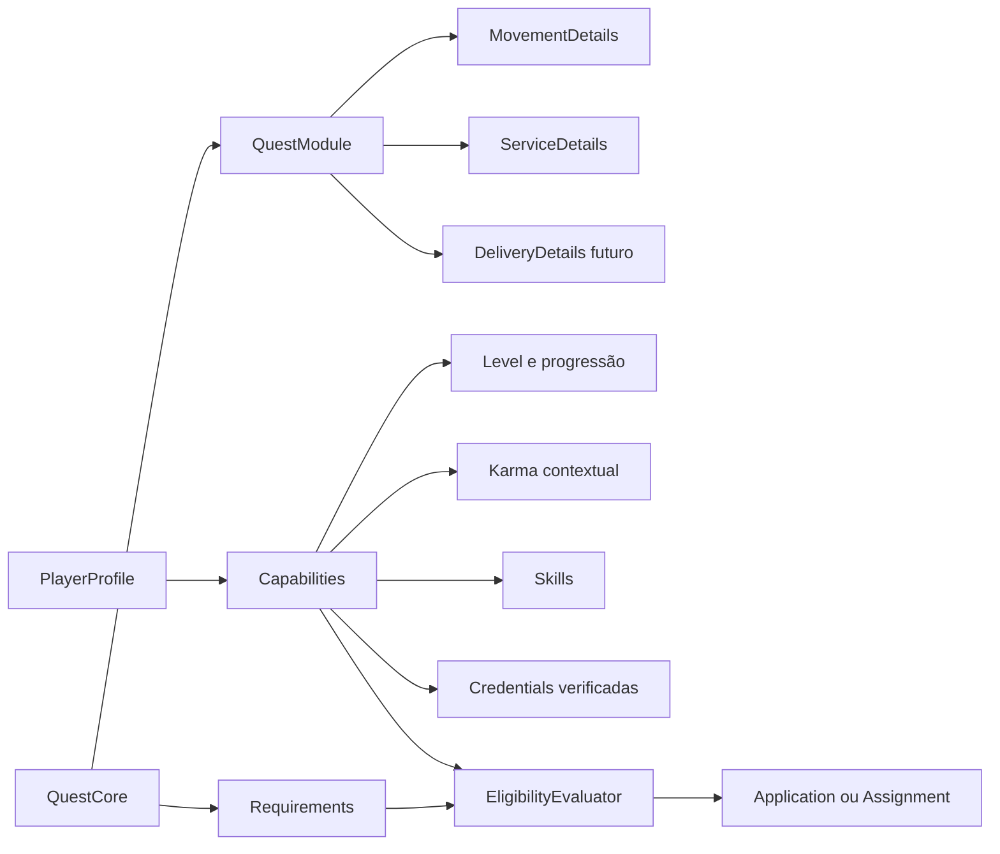

# Motor extensível de quests

## Objetivo

Tratar `Quest` como um contrato genérico de trabalho, deslocamento ou colaboração. O primeiro produto usa quests de deslocamento, mas o núcleo não pode presumir que toda quest possui motorista, veículo, origem e destino.

O modelo combina um núcleo relacional estável com módulos tipados. Campos universais permanecem em `quests`; detalhes específicos ficam em estruturas próprias de cada módulo. Não serão aceitos scripts ou regras arbitrárias enviados pelo cliente.

## Núcleo universal

Toda quest possui, no mínimo:

- identidade, criador e versão;
- tipo/módulo e categoria;
- título, descrição e anexos permitidos;
- visibilidade e região de descoberta;
- janela de execução ou agendamento;
- recompensa e moeda, quando aplicável;
- estratégia de atribuição;
- requisitos de elegibilidade;
- estado, responsáveis e linha do tempo auditável.

O núcleo não conhece termos como `driver`, `vehicle` ou `destination`. Esses conceitos pertencem ao módulo de deslocamento.

## Módulos tipados

### Deslocamento

- origem, destino e possíveis paradas;
- passageiro, item ou modalidade;
- veículo e requisitos legais;
- rota, sessão de navegação, chegada e localização ao vivo.

### Prestação de serviço

- local presencial, remoto ou híbrido;
- escopo do serviço e categoria, como encanamento;
- fotos, diagnóstico inicial e materiais;
- disponibilidade, duração estimada e agendamento;
- evidências de execução e aceite do resultado.

Novos módulos implementam contratos conhecidos de validação, apresentação, matching e ciclo de vida. Templates criados por usuários ou empresas poderão combinar capacidades suportadas, mas não criar código executável nem alterar regras de segurança.

## Requisitos e elegibilidade

Requisitos são predicados tipados e versionados, por exemplo:

- `MinimumLevel(level = 10)`;
- `MinimumKarma(score = 80, scope = PLUMBING)`;
- `RequiredSkill(skill = PLUMBING, minimumProficiency = INTERMEDIATE)`;
- `RequiredCredential(type = PLUMBING_COURSE, verification = VERIFIED)`;
- `MaximumDistance(kilometers = 15)`;
- `RequiredVehicle(type = MOTORCYCLE)`.

O servidor avalia todos os predicados e retorna um resultado explicável: elegível, não elegível ou pendente de comprovação, com motivos seguros para exibição. A decisão usa uma fotografia versionada das qualificações no momento da candidatura ou aceite para permitir auditoria posterior.

Requisitos não podem usar atributos protegidos ou criar discriminação ilegal. O cliente nunca decide sozinho se um jogador é elegível.

## Skills, credenciais e reputação

Uma skill representa capacidade, não necessariamente comprovação. Ela pode ter níveis de confiança:

1. autodeclarada;
2. endossada por avaliações relacionadas;
3. comprovada por credencial;
4. verificada pela plataforma ou parceiro autorizado.

Uma credencial registra tipo, emissor, titular, evidência protegida, datas de emissão/validade e estado de verificação. Documentos brutos ficam privados; quem publica a quest recebe apenas a afirmação necessária, como “curso de instalações hidráulicas verificado”.

### Proficiência e XP por skill

Level global, proficiência e comprovação são eixos independentes:

- **level global:** participação e progressão geral no Minimapa;
- **XP de skill:** experiência prática acumulada em uma capacidade específica;
- **proficiência:** faixa derivada do XP daquela skill, como aprendiz, competente, especialista e mestre;
- **verificação:** confiança externa proveniente de credencial, parceiro ou auditoria.

Cada definição de serviço possui um mapa versionado de skills e pesos. Concluir uma quest de troca de chuveiro pode conceder XP principal em `PLUMBING` e, quando o escopo realmente exigir, XP secundário em outra skill já aprovada. O evento `QuestCompleted` cria lançamentos idempotentes em `skill_xp_ledger`; uma mesma execução nunca concede XP duas vezes.

O XP pode nascer como pendente e ser confirmado após aceite do resultado ou janela curta de disputa. Fraude, cancelamento ou decisão de disputa pode bloquear ou reverter a concessão por evento compensatório, sem apagar o histórico.

O perfil não materializa milhares de skills vazias. Uma skill aparece para o jogador somente quando existe pelo menos uma destas evidências:

- XP recebido em quest válida;
- credencial associada;
- comprovação ou verificação aprovada.

Uma credencial pode tornar a skill visível e elevar seu nível de verificação, mas não inventa experiência prática. Requisitos podem pedir proficiência, verificação ou ambas.

Karma não deve ser somente uma nota global. O sistema mantém reputação contextual por categoria e papel, derivada de eventos auditáveis. Uma boa avaliação em entregas não comprova habilidade em encanamento. Penalidades, expiração, contestação e prevenção contra avaliações combinadas precisam ser definidas antes de o karma bloquear acesso a trabalho.

## Estratégias de atribuição

O mesmo núcleo aceita diferentes estratégias:

- `FIRST_ELIGIBLE_ACCEPTS`: primeiro jogador elegível aceita; apropriado para certas quests de deslocamento.
- `OWNER_SELECTS_APPLICATION`: interessados se candidatam e o criador escolhe; apropriado para serviços.
- `QUOTE_AND_SCHEDULE`: candidatos enviam orçamento e disponibilidade antes da escolha.
- `INVITE_ONLY`: criador convida jogadores elegíveis.

Concorrência e autorização permanecem atômicas no servidor em todas as estratégias.

## Ciclo de vida

O ciclo universal será pequeno:

`draft → published → matching → assigned → active → completed`

Saídas comuns: `cancelled`, `expired` e `disputed`. Cada módulo possui subestados próprios. Por exemplo, deslocamento pode usar `en_route` e `arrived`; serviço pode usar `scheduled`, `diagnosing`, `awaiting_materials` e `awaiting_owner_approval`.

Eventos de domínio registram todas as transições. Interfaces e notificações reagem a eventos, evitando acoplamento direto entre módulos.

## Persistência planejada

- núcleo: `quest_types`, `quests`, `quest_requirements`, `quest_events`;
- matching: `quest_applications`, `quest_assignments`, `eligibility_evaluations`;
- módulos: `quest_movement_details`, `quest_service_details`;
- capacidades: `skills`, `player_skills`, `credentials`, `credential_verifications`;
- progressão específica: `service_skill_rewards`, `skill_xp_ledger`, `skill_proficiency_levels`;
- confiança: `reputation_events`, `reputation_scores`, `ratings`.

Campos flexíveis podem existir para metadados de apresentação versionados, mas dados usados por autorização, dinheiro, elegibilidade ou busca devem ser tipados e indexáveis.

## Modularização Android

Evolução planejada dos módulos Gradle:

- `:app`: composição, inicialização e navegação global;
- `:core:domain`: contratos de quest, jogador, requisitos e eventos;
- `:core:rules`: representação local dos resultados de elegibilidade;
- `:core:data`: repositórios e sincronização;
- `:core:designsystem`: tokens e componentes compartilhados;
- `:feature:explore`, `:feature:quests`, `:feature:navigation`, `:feature:profile`;
- `:feature:services` quando a segunda família de quest entrar no produto.

Os módulos serão extraídos junto às primeiras funcionalidades reais, evitando criar dezenas de módulos vazios. Dependências apontam das features para contratos de `core`; uma feature não importa implementação interna de outra.
