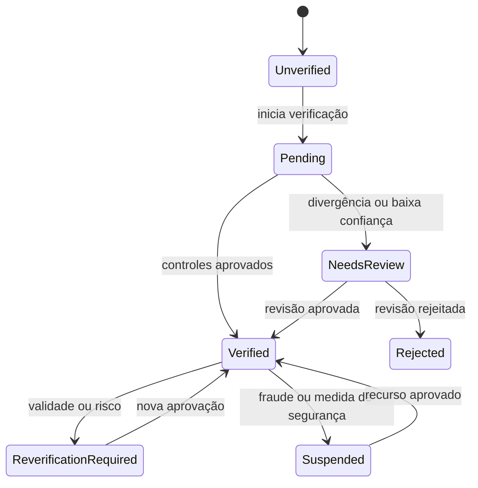

# Confiança e verificação de usuários

## Princípio

Verificação reduz anonimato e fraude, mas não certifica caráter, competência ou segurança absoluta. A interface usa afirmações precisas, como **Identidade verificada** e **Credencial verificada**; nunca rotula uma pessoa como “segura” ou “insegura”.

Somente jogadores com identidade verificada podem ser atribuídos a uma quest, executá-la ou concluí-la. Usuários não verificados podem explorar e publicar quests de baixo risco com alcance limitado, mas precisam concluir a verificação antes de a quest avançar para atribuição e execução.

## Camadas independentes

1. **Conta autenticada:** login por email, telefone ou provedor social.
2. **Contato confirmado:** posse de email e telefone confirmada.
3. **Identidade verificada:** documento, dados cadastrais, idade e prova de vida/selfie avaliados por provedor e, quando necessário, revisão humana.
4. **Papel verificado:** requisitos adicionais para motorista, comerciante ou outra função regulada.
5. **Skill/credencial verificada:** comprovação profissional específica; não substitui identidade.
6. **Sessão de alta confiança:** MFA recente para ações sensíveis; não substitui verificação documental.

Um badge sempre declara qual camada foi validada. “Identidade verificada” não implica “encanador verificado”; “curso verificado” não implica boa reputação.

## Capacidades por estado

| Capacidade | Não verificado | Identidade pendente | Identidade verificada |
| --- | --- | --- | --- |
| Explorar conteúdo público | sim | sim | sim |
| Criar rascunho de quest | sim | sim | sim |
| Publicar quest de baixo risco | sim, alcance limitado | sim, alcance limitado | sim |
| Exibir endereço exato publicamente | nunca | nunca | nunca |
| Candidatar-se ou aceitar quest | não | não | sim |
| Ser atribuído/executar/concluir | não | não | sim |
| Ativar quest publicada por solicitante não verificado | não | não | sim |
| Publicar serviço regulado/alto risco | não | não | conforme requisitos extras |
| Votar no Conselho do Reino | não | não | conforme regras do ciclo |

Uma quest de solicitante não verificado mostra **Identidade do solicitante não verificada** e `verification_required_before_assignment`. Prestadores podem demonstrar interesse sem receber endereço exato, contato direto ou atribuição. Ao verificar-se, o solicitante libera o matching normal sem precisar republicar a quest.

## Estados e reavaliação

Estados mínimos:

- `UNVERIFIED`;
- `PENDING`;
- `NEEDS_REVIEW`;
- `VERIFIED`;
- `REJECTED`;
- `REVERIFICATION_REQUIRED`;
- `EXPIRED`;
- `SUSPENDED`.

O status possui motivo interno, datas, método, nível de confiança, versão da política e validade. Expiração de documento, alteração relevante, fraude provável ou recuperação sensível de conta pode exigir nova verificação. Usuários têm um fluxo de recurso; detalhes antifraude não são expostos.

## Autorização no Supabase

- A fonte de verdade fica em tabelas controladas pelo servidor, nunca em `user_metadata` editável pelo usuário.
- Claims em `app_metadata` podem acelerar a interface, mas operações críticas consultam estado atual porque JWTs podem estar desatualizados.
- RLS bloqueia candidaturas, atribuições e mudanças de estado para identidades não verificadas.
- Uma função privada e uma operação transacional validam simultaneamente identidade do executor, identidade do solicitante, requisitos da quest e estado permitido.
- Ações sensíveis podem exigir sessão `aal2`/MFA além da identidade documental.
- `service_role` permanece somente no backend; aplicativos móveis recebem apenas chave publicável.

Verificação de identidade e MFA são controles diferentes. O nível `aal2` confirma um segundo fator da sessão, não um documento civil.

## Dados e integração com provedor

O domínio usa um adaptador `IdentityVerificationProvider` para evitar dependência permanente de uma empresa. O backend inicia a sessão de verificação, recebe webhooks assinados e traduz resultados para estados internos idempotentes.

Armazenar o mínimo possível:

- identificador da verificação no provedor;
- resultado, nível de confiança e códigos internos necessários;
- nome normalizado, data de nascimento e identificadores estritamente necessários, preferencialmente protegidos/tokenizados;
- referências de evidência e trilha de auditoria;
- datas de criação, decisão, validade e exclusão programada.

Documentos e biometria brutos não ficam em tabelas públicas. Se precisarem transitar pelo Storage, usam bucket privado, caminhos por usuário, acesso temporário, retenção curta e auditoria. A política final de retenção e base legal deve ser validada antes do piloto.

## Controles adicionais

- rate limits para tentativas e reenvios;
- detecção privada de contas duplicadas e dispositivos abusivos;
- assinatura e replay protection em webhooks;
- revisão manual para resultados inconclusivos;
- revogação e bloqueio emergencial;
- notificação de mudanças de estado;
- logs sem documento, biometria ou endereço completo;
- testes tentando contornar RLS, usar JWT antigo e repetir webhooks.
